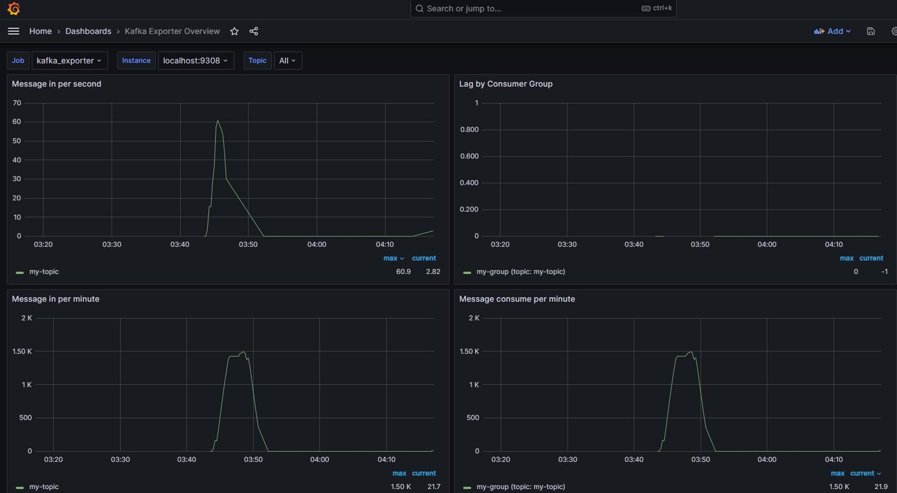

# Simple Go App Notes:

Simple Go App to monitor Kafka metrics in Grafana !
App contains 2 basic endpoints ;

GET : /health
POST : /book

#### GO Part :

- https://github.com/gin-gonic/gin (Http Framework for GO)
- https://github.com/joho/godotenv (Loading Env variable)
- https://github.com/go-gorm/gorm  (ORM for GO)
- https://pkg.go.dev/github.com/segmentio/kafka-go (Kafka-Driver)
- https://github.com/githubnemo/CompileDaemon (Hot Reload and more ...)

- Type `CompileDaemon -command="./go-crud.exe"` to run Go App !


#### Monitoring Part :

- https://grafana.com/grafana/download (Open Source : for monitoring)
- https://prometheus.io/download/ (Time-Series DB)
- https://github.com/danielqsj/kafka_exporter (Metric Collector for Prometheus to visualize in Grafana)


### Boosting Monitoring Part

#### Grafana Part

For Windows :
```bash 
  .\grafana-server.exe
```
- You should access to http://localhost:3000
- Default user and password : `admin`
- You should go Plugins page and add Prometheus as a data source.
- Final Step ; Import DashBoard and type in ID field as `7589` and load it.
- You also need to run your kafka to see metrics in Grafana !

#### Prometheus Part

You should add config into  `scrape_configs` part in prometheus.yml

```bash 
  scrape_configs:
  - job_name: "kafka_exporter"
    static_configs:
      - targets: ["localhost:9308"]    
```    

For Windows :
```bash 
  ./prometheus.exe
```    

#### Kafka Exporter Part

For Windows :
```bash 
  .\kafka_exporter.exe --kafka.server=localhost:9092
```    

#### DB PART

Docker :
```bash 
  docker compose up -d 
```    

#### DB PART

Kafka Metrics DashBoard (7589)

